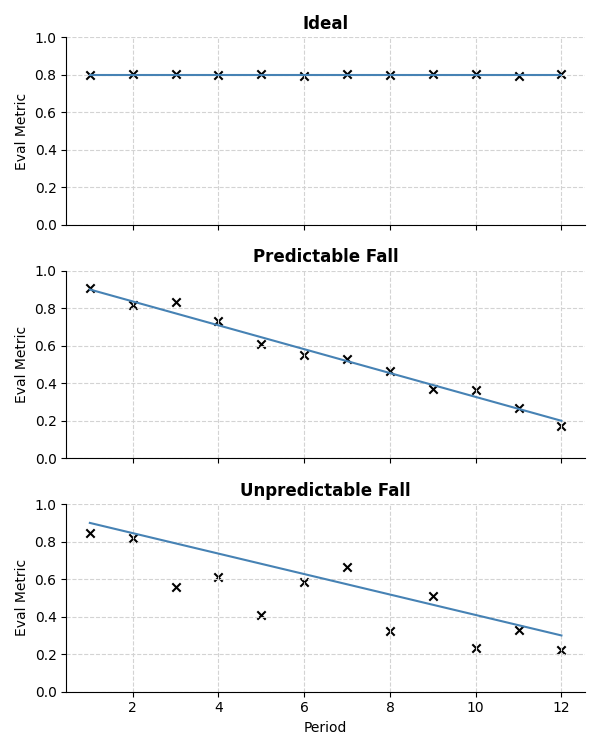

# Model Stability Metric

## Concept

The *stability* of a model is defined as its ability to maintain consistent performance over time or across different conditions. The `stability_index` metric quantifies this by considering:

- The average value of a performance metric (e.g., accuracy, F1-score).
- The trend (slope) of the metric over time (penalizing decreasing trends).
- The variability (standard deviation of residuals) around the trend (penalizing high fluctuations).

A higher stability index indicates a more stable model. 

## Visualizing Stability Patterns

The plot bellow illustrates different behaviors of a model's performance metric (such as accuracy) over time:

The are four critical patterns to be considered when evaluating the stability metric:

| Pattern | Description | Stability Index Impact |
|---|---|---|
| **Stable High** | The metric remains high and consistent. | High stability index (high mean, low penalty).   |
| **Decreasing Trend** | The metric shows a downward trend. | Lower stability index due to falling rate penalty.|
| **High Variability** | The metric fluctuates significantly, even if the mean is high. | Reduced stability index from variability penalty. |
| **Stable Low** | The metric is consistent but at a low value. | Low stability index due to low mean. |

## Methodology

Given a sequence of metric values $\mathbf{m} = [m_1, m_2, \ldots, m_T]$ over $T$ time points (e.g., epochs), the stability index is computed as:

$$
\text{Stability Index} = \overline{m} + w_f \cdot \min(0, s) - w_v \cdot \sigma_r
$$

Where:

- $\overline{m}$ is the mean of the metric vector:

  $$
  \overline{m} = \frac{1}{T} \sum_{t=1}^T m_t
  $$

- $s$ is the slope of the best-fit line (via linear regression) through the metric values.
- $w_f$ is the falling rate weight (default: 12).
- $w_v$ is the variability weight (default: 0.5).
- $\sigma_r$ is the standard deviation of the residuals:

  $$
  \sigma_r = \sqrt{ \frac{1}{T} \sum_{t=1}^T (m_t - \hat{m}_t)^2 }
  $$

  where $\hat{m}_t$ is the predicted value from the regression line at time $t$.

### Penalties

- **Falling Rate Penalty:** If the slope $s$ is negative (performance is decreasing), a penalty proportional to $w_f$ is applied.
- **Variability Penalty:** High variability around the trend is penalized, scaled by $w_v$.

## Interpretation

- **Higher values**: Indicate greater stability (high mean, low decrease, low variability).
- **Lower values**: Indicate instability (decreasing trend and/or high fluctuations).